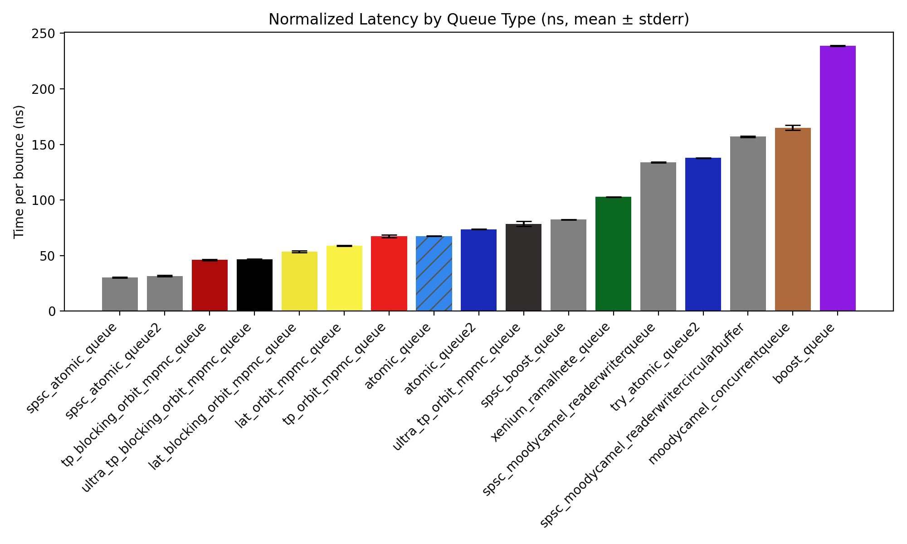
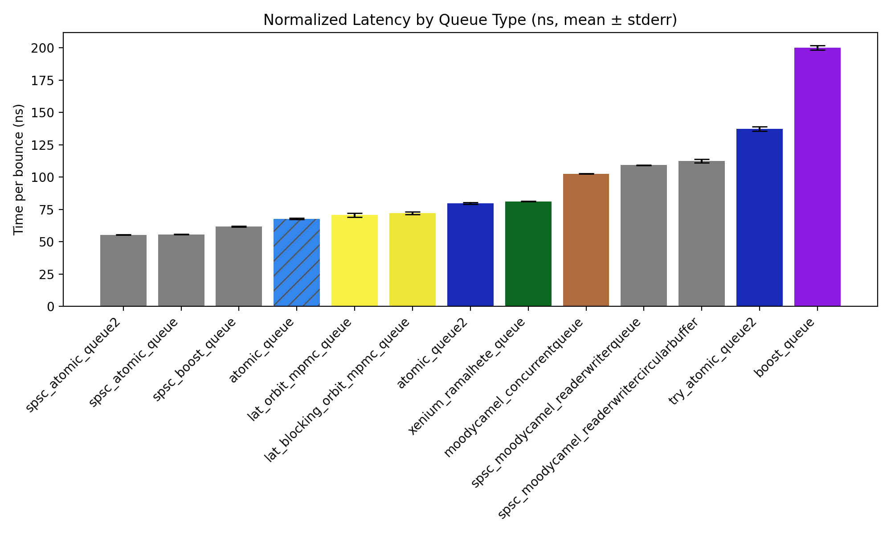

# Orbit

This is a high performance lock-free multi-producer multi-consumer bounded queue. It is implemented as a single header only library in C++20 (although the benchmarks use C++23 for convenience).

## Who should use this

There are a number of existing lock-free queue implementations in C++ at this point. Why should you use this one?

- It is [faster](#benchmarks) than other implementations in most cases, on both x86 and ARM architectures.
- There are no arbitrary restrictions on element type: The only limitations in place are by choice, to enforce effective usage.
    - Elements must be default constructible. They are stored contiguously in a `std::array`. If your type doesn't have a default constructor, you should probably be wrapping it in a unique pointer anyway.
    - For non-trivially copyable types of size greater than 16 bytes, all operations are move-only. Again, if your type doesn't work with this, you should be wrapping it in a unique pointer.
- Offers a simple and versatile interface
    - Offers both blocking (`push`/`pop`) and non-blocking (`try_push`/`try_pop`) operations - with _no meaningful performance difference_. Use whichever suits your use case.
    - Has functions `was_empty` and `was_full`, and `was_size` which offer useful hints as well as aiding debugging. On x86, the first two are also chosen to not allow false positives. On ARM, we choose to prioritise performance and allow relaxed stores for the front and back.
- Easily tunable and configurable for your platform and use case. See [below](#tuning-the-queue-for-your-platform) for more information on this.

More precisely, in terms of performance figures, you should consider using this queue in the following circumstances:

- You want the lowest possible latency MPMC queue in any situation ([benchmarks](#latency)).
- You want the highest throughput thread safe queue in any situation (including SPSC) ([benchmarks](#throughput)).

Obviously, if in doubt run your own benchmarks to choose the best solution for your use case! There are of course some cases where better solutions exist elsewhere. We list some here:

- You need an unbounded queue. In which case, a block-based linked queue such as `xenium/ramalhete_queue` would be your best bet, both in terms of latency and throughput.
- You only need blocking `push` and `pop` operations and are only pushing atomic types to the queue. In which case, `atomic_queue` used in SPSC mode should give better results.
- You are running on a virtualised CPU. I doubt that some of the optimisations used here would play well with the scheduler in this case...

## Usage

The queue is provided as a single header which you can include into your project.

There are several template parameters to configure the queue. First, you must provide the data type and queue size. Then we provide two primary modes via a boolean flag - true to minimise latency (the default configuration), false to maximise throughput. We also provide a flag NONBLOCKING which defaults to true. If you want the lowest possible average latency and don't care much about theoretical guarantees of lock-free behaviour, you can set this to false. This removes one of the two CAS operations in the push/pop operations, leading to significantly lower latency on average. Then there are some (optional but recommended) pause length parameters which depend on the platform - there are benchmarks that can be used to choose these (more on this below), or alternatively guidance is provided for appropriate values.

We provide the following public methods (note `T/T&&` indicates that it accepts a pass by value only if the type is trivially copyable and <= 16 bytes):
- `push(T/T&& element)` Push an element to the queue, and busy wait if it is full.
- `T pop()` Pop an element from the queue and return it, and busy wait if it is empty.
- `bool try_push(T/T&& element)` Push an element to the queue and return true if it is not full, otherwise return false.
- `bool try_pop(T& element)` Pop an element from the queue and return true if it is not empty, otherwise return false.
- `bool was_empty()` Queue was empty when checked. May return a false negative, but not a false positive.
- `bool was_full()` Queue was full when checked. May return a false negative, but not a false positive.
- `size_t was_size()` Approximate size of the queue, only really useful for debug purposes.

Note that the size of the queue must be a power of two - using a different size will produce a compilation error. Furthermore, for non-trivially copyable types, and any type of size greater than 16 bytes, the queue is move-only. Finally, if you use the `try_push`/`try_pop` functions in a spin loop, you do not need to add a spin pause as this is built in and tuned for optimum performance already. Note that there is no measurable performance hit from using these methods, unlike some [other implementations](#throughput)!

```cpp
#include <orbit/mpmc_queue.h>

orbit::mpmc_queue<std::unique_ptr<msg_t>, 1024> q;
auto message = std::make_unique<msg_t>(...);
q.push(std::move(message));

std::unique_ptr<msg_t> result;
if (q.try_pop(result)) { ... }
```

## Benchmarks

We provide a selection of benchmarks to compare against existing implementations. All benchmarks were run on an AMD Ryzen 5600X. We show a few different configurations of our queue: Optimised for latency or throughput, and truly lock-free or the faster version described above. We colour our queue optimised for latency in yellow, throughput in red, and more aggressively optimised for throughput in black. Note that the queues in grey are _SPSC-only_, and `atomic_queue` is marked hatched as it only supports atomic types, not strings, structs, unique pointers etc.

### Latency

For this test, we take two queues, and in two threads repeatedly push to one queue and pop from the other. We push 100000 integers through the queue this way. This measures the average time taken for a value to be pushed and then popped from a queue - thus is a measure of latency.


*AMD Ryzen 5600X*


*Apple M2 Pro*

Note, we do not recommend using the queue in throughput mode if you care about latency. It turns out to perform quite well anyway in testing on x86, perhaps because spurious fails are rare (I have not verified this, just a hypothesis), but on ARM the latency is high. We do not show this on the graph to maximise readability.

### Throughput

Here, we simply push 1000000 integers through the queue for varying numbers of producers and consumers, and measure the time taken. We offer two benchmarks here.

The first uses the common "push" and "try_pop" pattern - consumer threads will monitor for cancellation, and clear out the queue before exiting. Note that many existing implementation struggle with this: `atomic_queue` suffers a huge performance hit when using `try_pop`, and `ramalhete_queue` does not offer any method to determine whether the queue is empty (or the current size), whilst other queues that did provide these methods did not offer guarantees of over or underestimation (so false positive `empty` results were allowed, for example).


*AMD Ryzen 5600X*


*Apple M2 Pro*

For the second benchmark, each consumer simply pops a fixed number of elements (essentially total number of values / number of consumers) before returning.


*AMD Ryzen 5600X*


*Apple M2 Pro*

For reference, the following paremeters were chosen for each test setup:
- AMD Ryzen 5600X:
    - PAUSE_SHORT=3 (NONBLOCKING mode), PAUSE_SHORT=2 (BLOCKING mode)
    - PAUSE_LONG=40 (throughput mode, coloured red), PAUSE_LONG=100 (ultra throughput mode, coloured black)
- Apple M2 Pro:
    - PAUSE_SHORT=2
    - PAUSE_LONG=100 (throughput mode, coloured red), PAUSE_LONG=200 (ultra throughput mode, coloured black)

## Installation

Orbit is a single header library. The simplest approach is to just copy `include/orbit/mpmc_queue.h` into your project.

Alternatively, if you use CMake or Meson, you can pull it in directly.

**CMake (FetchContent)**
```cmake
include(FetchContent)
FetchContent_Declare(orbit
    GIT_REPOSITORY https://github.com/austin-hill/orbit
    GIT_TAG        main
)
FetchContent_MakeAvailable(orbit)
target_link_libraries(my_target PRIVATE orbit::orbit)
```

**Meson (subproject)**
Either clone the repo into your `subprojects/` directory, or create a [wrap file](https://mesonbuild.com/Wrap-dependency-system-manual.html). Then in your `meson.build`:

```meson
orbit_dep = dependency('orbit', fallback: ['orbit', 'orbit_dep'])
```

Then in either case:
```cpp
#include <orbit/mpmc_queue.h>
```

## Tuning the queue for your platform

Depending on your CPU architecture, your spin pause length may differ significantly. Based on limited testing, the following choices may work well for x86 processors:

  - PAUSE_SHORT = 180 / NUM_CYCLES_PER_PAUSE
  - PAUSE_LONG = 3000 / NUM_CYCLES_PER_PAUSE (only used when maximising throughput)

Where NUM_CYCLES_PER_PAUSE is dependent on the target CPU - on modern AMD/Intel CPUs it is likely around the range of 30-150 clock cycles, but may be shorter on some older models.

If you want the maximum performance, you may wish to benchmark using `benchmarks/test_latency.cpp` or `benchmarks/test_throughput.cpp` to choose optimum pause lengths. These will generate graphs like the below.


## Testing

The script `tests/test_correctness.cpp` is designed to test the safety of the queue by essentially running a throughput benchmark for varying numbers of producers and consumers in order to achieve maximum contention in a variety of circumstances, whilst also storing the results and ensuring that what went into the queue came out the same. I have run this test extensively on both x86 and ARM platforms with no issues. Furthermore, the throughput benchmark also verifies that the number of values pushed matches the number of values received. However, a formal proof of correctness would require more leg work than I am willing to spend right now, so in the unlikely event you encounter any problems, feel free to open a github issue.

## Design, Implementation and Optimisation Decisions

This started as essentially a challenge to myself to fully implement a lock-free queue in C++, without looking at any existing solutions. My background is in pure mathematics (particularly analysis and analytic number theory), so please bear in mind that I may not be using the all the standard terminology, as I still don't know most of the conventions in this space.

The core of the queue is essentially a (non-atomic) circular buffer, which we step through with an odd stride length (which depends on whether we are optimising for latency or throughput), together with a second circular buffer storing state and synchronising the reads and writes using a standard acquire-release pattern.

Please see [my website](https://austinhill.me/posts/lock-free-queue/) for a full write up of this project, where I dive into the core of the algorithm in all presented variants, describe the optimisation process and present some useful graphs to visualise where some of the performance is gained.
